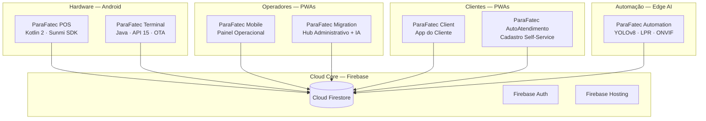

# ParaFatec — Documentação do Ecossistema

> Este documento centraliza a navegação pelo ecossistema ParaFatec. Os repositórios individuais são **privados** e contêm documentação técnica detalhada — READMEs, diagramas de arquitetura, guias de compilação e histórico de decisões de design.

---

## O que é o ParaFatec?

Um sistema completo de gestão de estacionamento construído do zero e operando em ambiente real. Nasceu como um único app Android nativo e evoluiu para um ecossistema distribuído de nove produtos — quando as limitações do app original (sem acesso iOS, sem suporte a hardware especializado) tornaram a migração necessária.

A decisão de usar o Firebase Spark Plan como backbone central — em vez de servidor próprio ou plano pago — foi tomada no início e nunca precisou ser revisada. O modelo de dados denormalizado e as regras de segurança do Firestore permitiram rodar nove produtos integrados sem custo de infraestrutura.

---

## Mapa do Ecossistema

---

## Produtos

### 📱 ParaFatec Mobile — Painel Operacional
**Repositório:** [thepreiss/ParaFatecMobile](https://github.com/thepreiss/ParaFatecMobile)
**Stack:** React 19 · TypeScript · Vite 7 · Tailwind CSS 4 · TanStack Query v5 · Framer Motion · Firebase

Interface principal para gestores e operadores. Gerencia o fluxo completo do pátio: check-in e check-out de veículos, controle de mensalistas, atribuição de vagas de capacete e monitoramento em tempo real. Installável como PWA em Android e iOS.

**Destaques técnicos:**
- Arquitetura hook-centric com TanStack Query para server state
- Biometria local para desbloqueio de sessão em dispositivos compartilhados
- Service Worker com cache offline e sincronização em background
- Design system "Vibrant Glass" em Tailwind 4 com arbitrary values

---

### 🚗 ParaFatec Client — App do Cliente
**Repositório:** [thepreiss/ParaFatecClient](https://github.com/thepreiss/ParaFatecClient)
**Stack:** React 19 · TypeScript · Vite 8 · Tailwind CSS 4 · Leaflet 1.9 · Framer Motion · ZXing · qrcode.react · Firebase

App instalável para o cliente final do estacionamento. Mostra status da mensalidade, histórico de acessos, gera o QR de entrada/saída e exibe o mapa de localização do estabelecimento.

**Destaques técnicos:**
- QR Code bidirecional: geração (qrcode.react) + leitura por câmera (ZXing)
- Mapa com Leaflet + react-leaflet integrado ao OpenStreetMap
- Regras Firestore garantem que clientes acessam apenas seus próprios dados

---

### 📊 ParaFatec Migration — Hub Administrativo
**Repositório:** [thepreiss/ParaFatecMigration](https://github.com/thepreiss/ParaFatecMigration)
**Stack:** React 19 · TypeScript · Gemini Flash API · ECharts · Chart.js · DataTables.net · jsPDF · ExcelJS · TanStack Query

Camada estratégica do ecossistema. O nome vem da origem: foi construído para substituir e absorver dados do app Android legado. Hoje é o painel de auditoria financeira, BI e gestão de contratos — com detecção de anomalias via Google Gemini.

**Destaques técnicos:**
- Integração com `@google/generative-ai` para auditoria automatizada de inconsistências
- Geração de PDF e Excel sob demanda (jsPDF + ExcelJS)
- DataTables.net com sorting e filtering de alto desempenho em datasets grandes
- Camada de leitura pura: lê de todos os nós operacionais, não escreve dados críticos

---

### 📠 ParaFatec POS — Terminal Handheld
**Repositório:** [thepreiss/ParaFatecPOS](https://github.com/thepreiss/ParaFatecPOS)
**Stack:** Kotlin 2.0 (K2) · Jetpack Compose · Material Design 3 · Firebase · ESC/POS (Sunmi SDK)

App Android rodando em dispositivos Sunmi na portaria do estacionamento. Operadores realizam check-in, check-out, validam mensalistas via QR Code e emitem tickets e recibos na impressora térmica embutida.

**Destaques técnicos:**
- Integração direta com impressora ESC/POS nativa Sunmi (sem Bluetooth)
- Queue local de operações com sync em background (resiliência offline)
- Clean Architecture com ViewModel + Repository + Cache local
- Suporte a Android 5.1+ (Lollipop) sem dependências de Play Services

---

### 📟 ParaFatec Terminal — Terminal de Pátio (George)
**Repositório:** [thepreiss/ParaFatecTerminal](https://github.com/thepreiss/ParaFatecTerminal)
**Stack:** Java (JDK 17, source compat 8) · Android API 15–19 · OkHttp 3.12.x · ZXing · Gson · Firebase Admin

Tablet fixo em modo kiosk posicionado na entrada/saída do pátio. Clientes interagem diretamente com ele para realizar check-in e check-out escaneando o QR Code do app Client.

O desafio central: manter TLS 1.2 funcional em Android 4.0.3 (API 15) — onde o runtime não suporta TLS moderno nativamente. Solução: OkHttp 3.12.x, última versão com suporte explícito a TLS 1.2 para stacks SSL legados.

**Sistema OTA:** Gerentes publicam uma atualização (JSON de manifesto + ZIP do APK) no Firebase Hosting. O terminal detecta a nova versão, baixa, extrai e instala automaticamente — sem ADB, sem acesso físico.

---

### 📱✅ ParaFatec AutoAtendimento — Cadastro Self-Service
**Repositório:** [thepreiss/ParaFatecAutoAtendimento](https://github.com/thepreiss/ParaFatecAutoAtendimento)
**Stack:** React 19 · TypeScript · Vite 8 · Tailwind CSS 4 · React Router DOM v7 · Firebase

PWA aberto pelo cliente no próprio celular para se cadastrar no estacionamento sem passar por um operador. Formulário multi-step (5 etapas) com validação de placa em tempo real, seleção de plano e ativação imediata do token QR de acesso.

---

### 👁️🤖 ParaFatec Automation — Engine de LPR
**Repositório:** [thepreiss/ParaFatecAutomation](https://github.com/thepreiss/ParaFatecAutomation)
**Stack:** Python 3.11+ · YOLOv8 (Ultralytics) · EasyOCR · OpenCV · onvif-zeep · firebase-admin

Engine de IA rodando on-premise em um dispositivo de borda conectado às câmeras IP do estacionamento. Detecta e lê placas de veículos em tempo real, registra eventos de entrada/saída no Firestore para mensalistas ativos.

**Pipeline de duas etapas:**
1. YOLOv8 localiza e recorta a região da placa no frame
2. EasyOCR extrai os caracteres do recorte

Apenas o texto da placa identificada chega à nuvem — nenhuma imagem ou frame de vídeo é transmitido.

---

### 🛡️ ParaFatec-Privacy — Portal de Privacidade
**Repositório:** [thepreiss/ParaFatec-Privacy](https://github.com/thepreiss/ParaFatec-Privacy)
**Live:** [privacy-parafatec.web.app](https://privacy-parafatec.web.app)
**Stack:** HTML5 · CSS3 · Firebase Hosting · Firebase App Check

Política de privacidade pública do ecossistema (LGPD). Site estático com dark mode, 12 seções navegáveis, cobrindo todos os produtos e requisitos legais — base legal do tratamento, transferência internacional (Resolução ANPD 19/2024), DPO nomeado, prazos de retenção e decisão automatizada (Art. 20 LGPD para o LPR).

---

### 🏗️ ParaFatec — Core Legado
**Repositório:** [thepreiss/ParaFatec](https://github.com/thepreiss/ParaFatec)
**Stack:** Kotlin 2.0 · Jetpack Compose · MVI (StateFlow) · Clean Architecture · Dagger Hilt · Firestore

O app Android original que deu origem ao ecossistema. Descontinuado após validar que gestores precisavam de iOS/desktop e que o hardware de pátio precisava de suporte nativo especializado. Documentado como referência arquitetural — o schema Firestore que todos os outros produtos ainda usam foi definido aqui.

---

## Decisões de Arquitetura

| Decisão | Alternativa considerada | Motivo da escolha |
|:---|:---|:---|
| Firebase Spark para 9 produtos | GCP pago / AWS | Schema denormalizado permite operar dentro dos limites gratuitos |
| PWA em vez de React Native | React Native / Flutter | Acesso multiplataforma sem APK; sem necessidade de Play Store para ferramentas internas |
| Java para Terminal (API 15) | Kotlin | Kotlin requer API 21+; dependências modernas são incompatíveis com API 15 |
| OkHttp 3.12.x específico | OkHttp 4.x | 4.x removeu suporte a TLS 1.2 em stacks SSL antigos do Android |
| LPR pipeline de dois estágios | Modelo unificado | YOLOv8 de localização + EasyOCR de OCR superam modelos end-to-end em placas parcialmente visíveis |
| Edge computing para LPR | Cloud Vision API | Custo zero + sem upload de imagens para a nuvem (compliance LGPD) |

---

*Documentação detalhada, diagramas e guias de compilação disponíveis nos repositórios individuais.*
